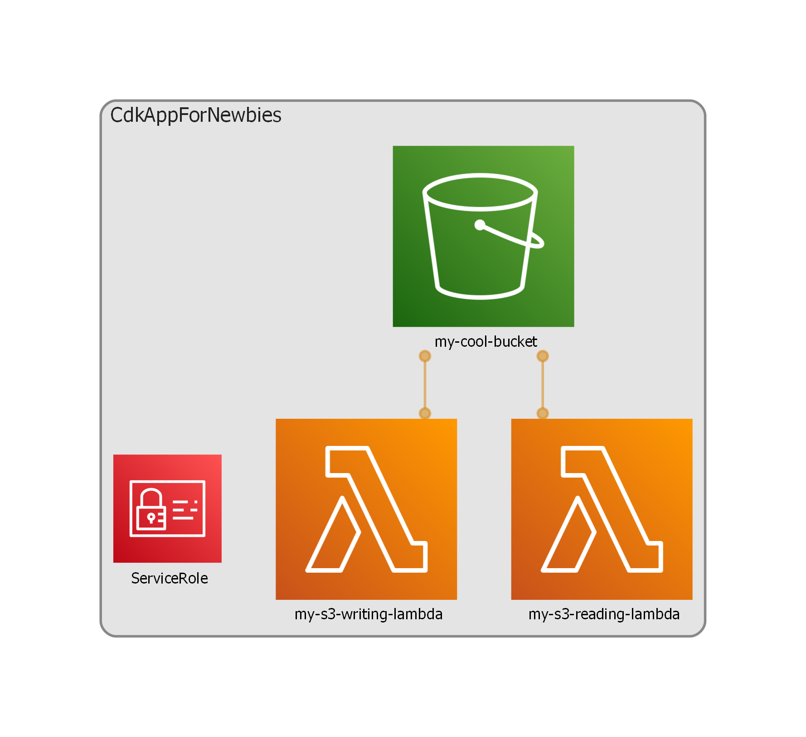

# CDK App For Newbies

A reference application for people who are new to AWS-CDK.

This app is referenced in https://phalanxhead.dev/tutorials/cdk_for_newbies/

## Purpose

To demonstrate how to write simple, decent CDK Code.

## What does the app do?

Reads and Writes to an S3 Bucket, just like most example code.

## What does the infrastructure look like?

This diagram was generated by [cdk-dia](https://github.com/pistazie/cdk-dia)

## How to I run it?

**Prereqs**
- [projen ^0.63.1](https://github.com/projen/projen)
- NodeJs 14+

1. Clone this repo
2. Run `npx projen` to download and install all the dependencies
3. Run `npx projen build` to compile and test the application
